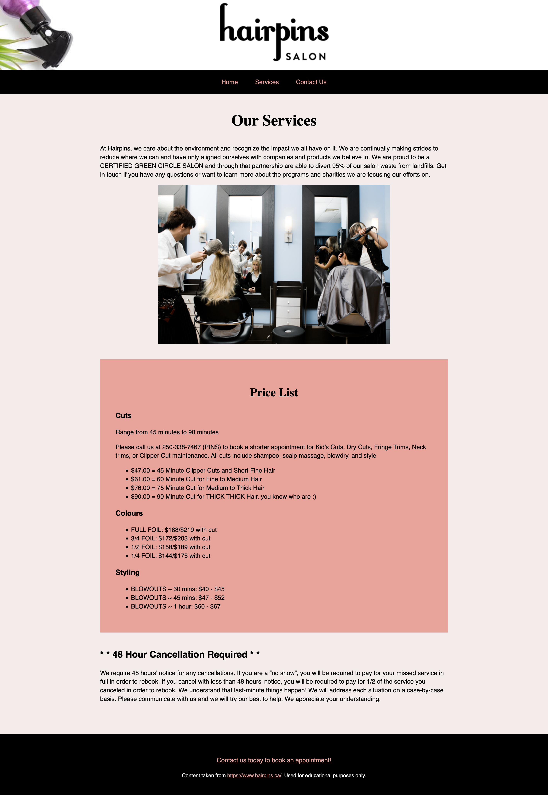

# Exercise 2 - CSS Essentials

## Objectives

The provided code is the HTML and CSS for a website inspired by a local company. However, the CSS is missing all of its selectors! You need to figure out which HTML elements to apply each style rule to, so that your finished website looks like the images below. After that, in part 2, you will write some HTML and CSS of your own to finish the contact page.

Homepage screenshot:


Services page screenshot:



## Instructions

Remember to:

- Regularly save your files and check out what your web page looks like in a web browser.
- Make regular commits and label them appropriately to document your progress.

### PART 1: Add the selectors for the Index and Services pages

1. Use GitHub Desktop to clone your remote exercise repository onto your local machine.
2. Open the repository in VS Code.
3. Open index.html in VS Code and in the browser. If you have the "Open in Browser" VS Code extension installed, you can right-click anywhere in the editor window of an HTML file and select Open in Default browser from the pop-up menu.
   Note: Working on websites is much easier when you can see both the code and the web browser at the same time. If you have a small laptop monitor, you might find this frustrating and prefer to work on a campus computer.
4. Open style.css and type appropriate selectors for every style. As you work, save your CSS and refresh the page in the browser to see your edits. You may need to use class, element (type), descendant or combination selectors. **You do not need to edit the HTML - there is no need to add CSS class names to the HTML**. There are many different correct ways that you could complete this exercise. I recommend that you don't delete any of the comments in the CSS as you may need to refer back to them.
5. Repeat the same process for the Services page (Ignore the contact page for now, we'll tackle it in part 2.)
6. Push your work to Github.

Example:

The CSS comment above each style rule indicates what HTML needs to be targeted.

```
/* all the paragraphs */
  {
  color: red;
}
```

In this scenario, the correct selector to add is p.

```
/* all the paragraphs */
p {
  color: red;
}
```

Notes:

- The provided code includes HTML elements and CSS properties that you haven't learned about yet. That's ok because this exercise is about understanding the relationships between the HTML elements and the syntax of the selectors. You don't need to understand all the code to be able to complete the exercise.
- Reminder: The syntax of a CSS comment is different to the syntax of an HTML comment.
- Pay attention to how CSS comments were used to identify and organise different groups of style rules. Adding organizational comments doesn't affect the code, but it helps you keep your CSS tidy and easier to read.
- You can use the browser inspect tools to help you. In the browser window, right-click > Inspect to see the HTML code rendered by the browser.

### PART 2: Write your own code for the Contact page

### Step 1: Style the Contact page colours

Write some new CSS style rules so that they target **only the contact page. You can edit the HTML of the contact page if you need to**.

- Give the whole page a background colour of your choice using a HEX value.
- Change the colour of all the text content on the page to a colour of your choice using a keyword.
- Change the colour of the headings on the page to a colour of your choice using an RGB value.
- Change the colour of the anchor elements using a HEX value.
- The contrast between the background and all the font colours must pass the WebAIM contrast checker test https://webaim.org/resources/contrastchecker/. You will need to run the test three times, once for each font colour. Take screenshots of your test results (you will need to submit them in Brightspace).

### Step 2: Style the Contact page text

- Go to https://fonts.google.com/ and find a font family or typeface that is easy to read. It can be a variable font or a static font. Get the embed code.
- In VS Code, paste the embed code in the head of the contact page.
- In Google Fonts, copy the font's CSS class. In VS Code, paste it and modify the selector(s) to apply the font to all the text on the Contact page.
- Apply two font weights to the Contact page content (tip: headings are often bolder than body text).
- Use all of the following properties to style the content:
  - text-transform
  - font-style
  - text-align
  - column-count
  - line-height
  - letter-spacing properties

### Step 3: Fix the text units for the whole site

- For the whole website, edit/add to the provided CSS to change the root font size to 62.5%;
- Change all font-size units in all the CSS to rems. Make sure the text doesn't change size in the browser.

### Step 4: Write your own HTML on the Contact page

1. Add a new group of content at the bottom of the contact page. You will need to write the content, HTML and CSS yourself. Include at least six different HTML elements in your new group of content.
2. Add an editorial image
   - Download a royalty-free image from this website: https://unsplash.com/. Add the image as an editorial image to your new group of content. The image must be an appropriate file type and it must be optimized - see your weekly reading for tips on how to optimize an image.
   - Give the image a caption.
   - Make the image width 600 pixels using HTML.
3. Style your new content using all of the following:
   - An ID selector
   - A class selector
   - A descendant selector
   - An internal (embedded) style rule
   - An inline style rule

### Step 5: Format and add comments

1. Use the Prettier VSCode extension to format your code (Right-click > Format document)
2. Add a few comments to explain your HTML and CSS code and highlight anything of interest.

### Step 6: Check for errors

1. Use the VSCode HTMLHint extension and the browser inspect tools to help you troubleshoot errors.
2. Validate your HTML code to check for errors: https://validator.w3.org/#validate_by_upload. Take a screenshot of the results.
3. Validate your CSS code to make sure that it is correct: https://jigsaw.w3.org/css-validator/ for CSS. Take a screenshot of the results.

**You have now completed your exercise but you still need to push your edits to GitHub and submit it in Brightspace. Make sure to follow the instructions in the How to Complete Your Exercises Guide. You will need to submit the screenshots of your WebAIM contrast checker tests, and the HTML and CSS validation results.**
